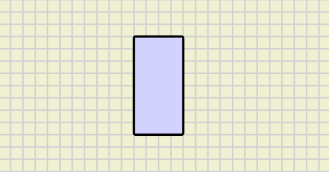
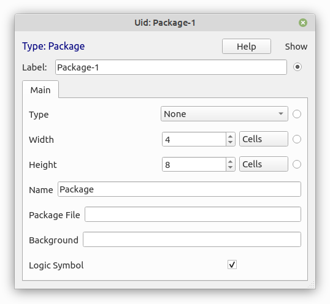
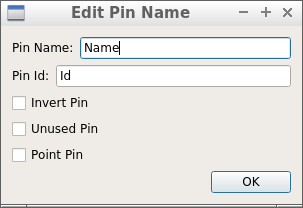
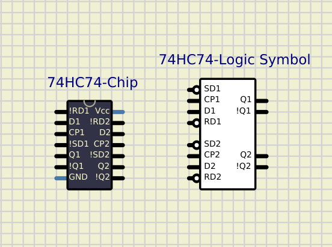

This component is only an interface to create package files.

# Creating Package File.

When you add this component to the circuit it is just a blue box, that's an empty package ready to be configured:

From here you can load an existing package file to edit it or create a new package.
To load or save a package file, Right-Click on it to open context menu.

**Don't forget to save the package file when you finish!!**

---

## Configuring Package:

To configure the package open Properties in the context menu:

- **Type:** There are 4 types available:
    1. None: normal subcircuit (if not sure use this).
    2. Logic: subcircuit with properties to configure all logic components inside.
    3. Board: subcircuit with graphic components .
    4. Shield: special subcircuit that docks into Arduinos (not recomended).
- **Width:** width of the package in grid cells.
- **Height:** height of the package in grid cells.
- **Name:** There are 3 options:
    1. Empty: no name in the package.
    2. "Package": uses the package file name.
    3. "Any name you want": custom name.
- **Package File:** path to the package file.
- **Background:** path to image or color(r,g,b).
- **Logic Symbol:**  Chip or Logic Symbol.

---

## Creating new Pins:

If you hover the mouse pointer along the package edges while pressing Shift Key you will see a grey fake pin.
If you keep Shift key and move the mouse pointer, the fake pin will move, so you can place the pin at any position in the package.

When the fake pin is correctly placed, mouse-click and a real Pin will appear.
At the same time a dialog will appear to configure the Pin:

- **Pin Name:** Label shown in the package.
- **Pin Id:** Unique Pin Id.
- **Invert Pin**: Pin Shows as inverted.
- **Unused Pin:** Inactive Pin
- **Point Pin:** Makes Pin Length = 0.

---

## Editing Pins:

You can edit existing pins by right-clicking on the edge of the package at the pin position.
A context menu will appear with pin options:  

- **Move:** Click and move Pin.
- **Edit:** Opens Edit Pin Dialog.
- **Delete**: Remove Pin.

---

## Package types:

There are 2 possible package types: Chip and Logic Symbol.
It is possible to have both options for the same component and switch between them:

There are some considerations to have in mind when you create both Chip and Logic Symbol packages for the same component. Both Packages must be Pin-compatible in order to work with the same subcircuit file:

- All active Pins must exist in both packages ( doesn't apply to unused pins).
- Same Pin must have same Id in both packages.

Note that There is an "Id" and a "Label"  for each pin, so a pin can have different labels in both packages while the Id must be the same.
As an example in the image above, for 74HC74  some pins have slightly different labels: !RD1 vs RD1 for example.

For inverted pins you can either use "!" as the first character of the label or set the pin as inverted.
It is recommended to use "!PinName" for Chip packages and "PinName"+invert-Pin for Logic Symbol packages, but in some cases you can use "!PinName" for both, for example "!Qn" outputs in 74HC74 package above.

#Component 