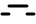
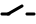
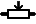
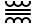
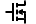
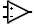
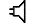
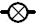
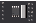
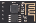

## Meters 
>  [Probe](01-Meters/Probe)
>  [Voltmeter](01-Meters/Voltmeter)
>  [Ampmeter](01-Meters/Ampmeter)
>  [Freqmeter](01-Meters/Freqmeter)
>  [Oscilloscope](01-Meters/Oscilloscope)
>  [Logic Analyzer](01-Meters/Logic%20Analyzer)
---
## Sources
>  [Fixed Volt](02-Sources/Fixed%20Volt)
>  [Clock](02-Sources/Clock)
>  [Wave Gen](02-Sources/Wave%20Gen)
>  [Voltage Source](02-Sources/Voltage%20Source)
>  [Current Source](02-Sources/Current%20Source)
>  [Battery](02-Sources/Battery)
>  [Rail](02-Sources/Rail)
>  [Ground](02-Sources/Ground)
---
## Switches
>  [Push](03-Switches/Push)
>  [Switch](03-Switches/Switch)
>  [Switchdip](03-Switches/Switchdip)
>  [Relay](03-Switches/Relay)
>  [KeyPad](03-Switches/KeyPad)
---
## Passive
   ### Resistors
   >  [Resistor](04-Passive/1-Resistors/Resistor)
   >  [Resistor Dip](04-Passive/1-Resistors/Resistor%20Dip)
   >  [Potentiometer](04-Passive/1-Resistors/Potentiometer)
   >  [Variable Resistor](04-Passive/1-Resistors/Variable%20Resistor)
   ### Resistive Sensors
   >  [LDR](04-Passive/2-Resistive%20Sensors/LDR)
   >  [Thermistor](04-Passive/2-Resistive%20Sensors/Thermistor)
   >  [RTD](04-Passive/2-Resistive%20Sensors/RTD)
   >  [Force Strain Gauge](04-Passive/2-Resistive%20Sensors/Force%20Strain%20Gauge)
   ### Reactive
   >  [Capacitor](04-Passive/3-Reactive/Capacitor)
   >  [Electrolytic Capacitor](04-Passive/3-Reactive/Electrolytic%20Capacitor)
   >  [Inductor](04-Passive/3-Reactive/Inductor)
   >  [Transformer](04-Passive/3-Reactive/Transformer)
---
## Active
   ### Rectifiers
   >  [Diode](05-Active/1-Rectifiers/Diode)
   >  [Zener Diode](05-Active/1-Rectifiers/Zener%20Diode)
   >  [SCR](05-Active/1-Rectifiers/SCR)
   >  [Diac](05-Active/1-Rectifiers/Diac)
   >  [Triac](05-Active/1-Rectifiers/Triac)
   ### Transistors
   >  [Mosfet](05-Active/2-Transistors/Mosfet)
   >  [BJT](05-Active/2-Transistors/BJT)
   ### Other Active
   >  [OpAmp](05-Active/3-Other%20Active/OpAmp)
   >  [Volt Regulator](05-Active/3-Other%20Active/Volt%20Regulator)
   >  [Analog Mux](05-Active/3-Other%20Active/Analog%20Mux)
---
## Outputs
   ### Leds
   >  [Led](06-Outputs/1-Leds/Led)
   >  [Led RGB](06-Outputs/1-Leds/Led%20RGB)
   >  [Led Bar](06-Outputs/1-Leds/Led%20Bar)
   >  [7 Segment](06-Outputs/1-Leds/7%20Segment)
   >  [Led Matrix](06-Outputs/1-Leds/Led%20Matrix)
   >  [Max72xx Matrix](06-Outputs/1-Leds/Max72xx%20Matrix)
   >  [WS2812 Led](06-Outputs/1-Leds/WS2812%20Led)
   ### Displays
   >  [HD44780](06-Outputs/2-Displays/HD44780)
   >  [AIP31068](06-Outputs/2-Displays/AIP31068)
   >  [PCD8544](06-Outputs/2-Displays/PCD8544)
   >  [KS0108](06-Outputs/2-Displays/KS0108)
   >  [SSD1306](06-Outputs/2-Displays/SSD1306)
   >  [ILI9341](06-Outputs/2-Displays/ILI9341)
   ### Motors
   >  [Dc Motor](06-Outputs/3-Motors/Dc%20Motor)
   >  [Stepper](06-Outputs/3-Motors/Stepper)
   >  [Servo](06-Outputs/3-Motors/Servo)
   ### Other Output
   >  [Audio](06-Outputs/4-Other%20Output/Audio)
   >  [Incandescent Lamp](06-Outputs/4-Other%20Output/Incandescent%20Lamp)
---
## Micro
   >  [AVR](7-Micro/AVR)
   >  [PIC](7-Micro/PIC)
   >  [I51](7-Micro/I51)
   >  [MCS65](7-Micro/MCS65)
   >  [Z80](7-Micro/Z80)
   >  [Arduino](7-Micro/Arduino)
   >  [Shields](7-Micro/Shields)
   ### Sensors
   >  [HC-SR04](7-Micro/8-Sensors/HC-SR04)
   >  [DHT22-11](7-Micro/8-Sensors/DHT22-11)
   >  [DS1621](7-Micro/8-Sensors/DS1621)
   >  [DS18B20](7-Micro/8-Sensors/DS18B20)
   ### Peripherals
   >  [Serial Port](7-Micro/9-Peripherals/Serial%20Port)
   >  [TouchPad (resistive)](7-Micro/9-Peripherals/TouchPad%20(resistive))
   >  [KY-023](7-Micro/9-Peripherals/KY-023)
   >  [Rotary Encoder (relative)](7-Micro/9-Peripherals/Rotary%20Encoder%20(relative))
   >  [DS1307](7-Micro/9-Peripherals/DS1307)
   >  [ESP01 (TCP)](7-Micro/9-Peripherals/ESP01%20(TCP))
---
## Logic
### Gates
>  [Buffer](08-Logic/1-Gates/Buffer)
>  [And Gate](08-Logic/1-Gates/And%20Gate)
>  [Or Gate](08-Logic/1-Gates/Or%20Gate)
>  [Xor Gate](08-Logic/1-Gates/Xor%20Gate)
### Arithmetic
>  [Counter](08-Logic/2-Arithmetic/Counter)
>  [Full Adder](08-Logic/2-Arithmetic/Full%20Adder)
>  [Shift Reg](08-Logic/2-Arithmetic/Shift%20Reg)
>  [Function](08-Logic/2-Arithmetic/Function)
### Memory
>  [FlipFlop D](08-Logic/3-Memory/FlipFlop%20D)
>  [FlipFlop T](08-Logic/3-Memory/FlipFlop%20T)
>  [FlipFlop RS](08-Logic/3-Memory/FlipFlop%20RS)
>  [FlipFlop JK](08-Logic/3-Memory/FlipFlop%20JK)
>  [Latch](08-Logic/3-Memory/Latch)
>  [RAM-ROM](08-Logic/3-Memory/RAM-ROM)
>  [Dynamic RAM](08-Logic/3-Memory/Dynamic%20RAM)
>  [I2C RAM](08-Logic/3-Memory/I2C%20RAM)
### Converters
>  [Mux](08-Logic/4-Converters/Mux)
>  [Demux](08-Logic/4-Converters/Demux)
>  [Decoder (4 to 10-16)](08-Logic/4-Converters/Decoder%20(4%20to%2010-16))
>  [Encoder (10-16 to 4)](08-Logic/4-Converters/Encoder%20(10-16%20to%204))
>  [BCD to 7S](08-Logic/4-Converters/BCD%20to%207S)
>  [I2C to Parallel](08-Logic/4-Converters/I2C%20to%20Parallel)
### Other Logic
>  [ADC](08-Logic/5-Other%20Logic/ADC)
>  [DAC](08-Logic/5-Other%20Logic/DAC)
>  [7 segment BCD](08-Logic/5-Other%20Logic/7%20segment%20BCD)
>  [LM555](08-Logic/5-Other%20Logic/LM555)
---
## Connectors
>  [Bus](09-Connectors/Bus)
>  [Tunnel](09-Connectors/Tunnel)
>  [Socket](09-Connectors/Socket)
>  [Header](09-Connectors/Header)
---
## Graphical
>  [Image](10-Graphical/Image)
>  [Text](10-Graphical/Text)
>  [Elipse](10-Graphical/Elipse)
>  [Line](10-Graphical/Line)
---
## Other
>  [Package](11-Other/Package)
>  [Dial](11-Other/Dial)

---

# Resources:

- Video: [SimulIDE1.0.0 basic use: Component list](https://www.youtube.com/watch?v=E9PQUgfZEjU)

---

#hub