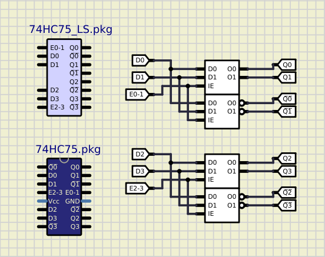

# Subcircuits

These components are just circuits "packed" inside a package.

There are already many subcircuits included in the default installation, for example all components of the 74 or CD series.
All the files for subcircuits in the default installation are in "data" folder.
You can have a look to the files of these components to get an idea of how they are implemented.

Creating a subcircuit involves these steps:

1. [](11-Other/Package#Creating%20Package%20File|Creating%20Package%20File.)
2. [#Creating circuit file.](#Creating%20circuit%20file.)
3. [#Creating component folder](#Creating%20component%20folder) with all files.
4. [#Add to component list](#Add%20to%20component%20list)
<br>

---

# Creating circuit file.

To use a circuit in a subcircuit just connect your circuit to [Tunnel](09-Connectors/Tunnel)s.
Then Set the names of these Tunnels the same as the **Pin Id**s in the Packages (not the Pin names).

Save this circuit and use this .sim1 file as circuit file.
  
You can do all in one Circuit, as in the image below, with both Chip and Logic Symbol packages and circuit.
This is not always required, but this way you can see and edit the package files and circuit in the same place:
  

<br>

---

## Creating component folder 

The simplest way is to use the the component name for the folder and all files as explained [](Custom%20Components#Creating%20component%20folder|here).

But it is possible to use different file names or use packages from other components.
To do this, you need to specify paths for these files as explained below.
<br>

---

## Add to component list.

The simplest method and common options is explained [](Custom%20Components#Add%20to%20component%20list|here).

But is is possible to use specific paths for package and circuit files.
Path to all files are relative to "data" folder.

```xml
<itemlib>  
  <itemset category="Some Category" type="Subcircuit">  
	<item name="Name1" package="file1.package" subcircuit="fileX.sim1" />  
	<item name="Name2" package="file2.package" subcircuit="fileY.sim1" />  
  </itemset>
</itemlib>
```
  
- **package** Is the path to package file, relative to SimulIDE data folder.  
- **subcircuit** Is the path to subcircuit .sim1 file, relative to SimulIDE data folder.
<br>

It is also possible to use a different method  for each **item**:
  
```xml
<itemset category="IC 74/7400-7499" type="Subcircuit" folder="ICs">  

  <item name="74HC00"  info="quad 2-input NAND gate" />

  <item name="Comp_X" folder="XX" info="My files in XX folder" />
  
  <item name="Comp_Y" package="blah/cY.package" 
                      subcircuit="bla2/compY.sim1" 
                      info=" My files are in blah & bla2 folders" />
  
</itemset>
```


---

# Resources:

## Videos:
- [Logic Subcircuits SimulIDE dev.](https://www.youtube.com/watch?v=NpuQUcKUbAg)

---

#tutorial 