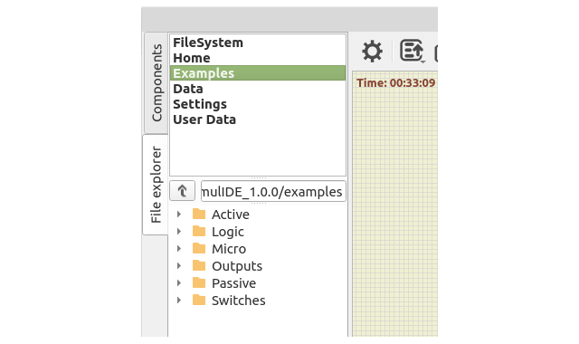

# File explorer

The File explorer is in the left panel, it is divided in 2 sections:

- [#Bookmarks:](#Bookmarks:) at the top.
- [#File tree:](#File%20tree:) below.

---

# Bookmarks:

There are some fixed bookmarks pointing to relevant places:
- **FileSystem:** file system root (shows disks in Windows).
- **Home:** User folder.
- **Examples:** SimulIDE example projects.
- **Data:** SimulIDE data folder.
- **Settings:** system folder containing SimulIDE settings file.
- **User Data:** SimulIDE user data folder.

You can add your own bookmarks from the [#File tree](#File%20tree).

---

# File tree:

There is a path box at the the top.

Below it, the file tree itself, works as usual:
- **Click** in the arrows to **expand/collapse** tree branches.
- **Double-Click in folder** to open folder
- **Double-Click in file** to open file in SimulIDE:

Right-Click in any file to open context menu:
- **Open in Editor:** open file in Editor.
- **Show Hidden:**  show hidden files.

Right-Click in any folder to open context menu:
- **Add Bookmark:** add this folder to bookmarks.
- **Show Hidden:**  show hidden files.

---

# Resources:

- Video: [SimulIDE1.0.0 basic use: File browser](https://www.youtube.com/watch?v=pUgpxV6I79o)

---

#tutorial